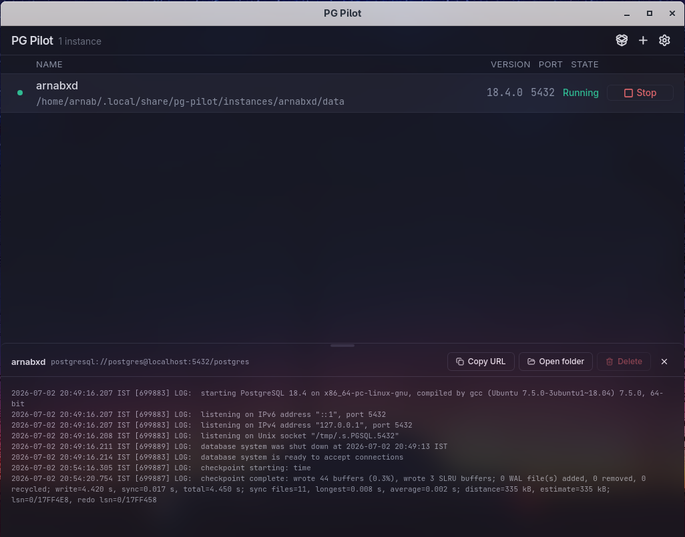
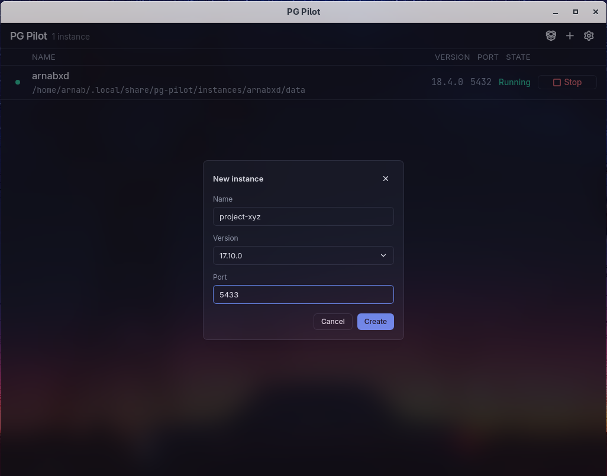
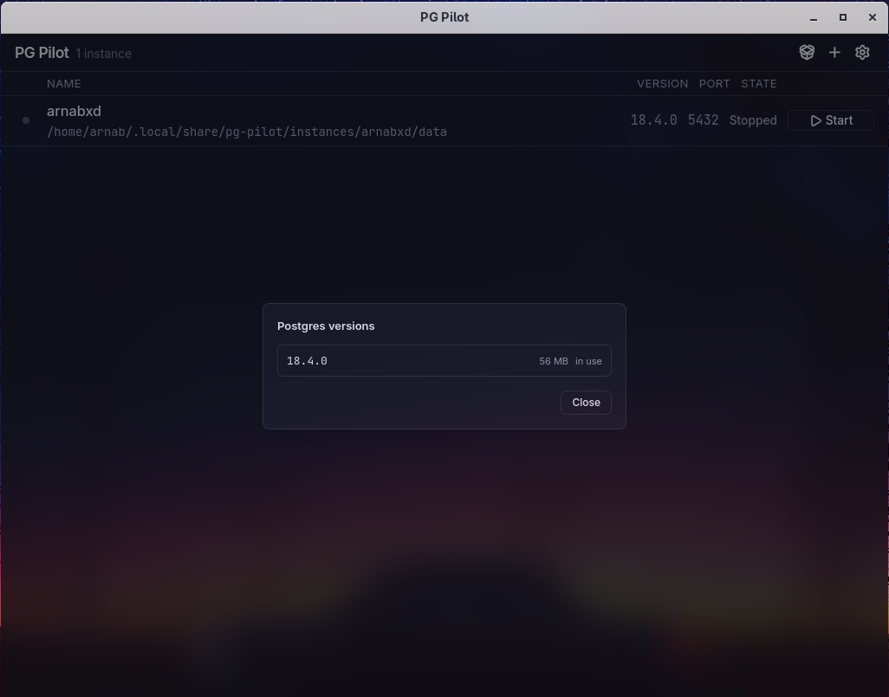
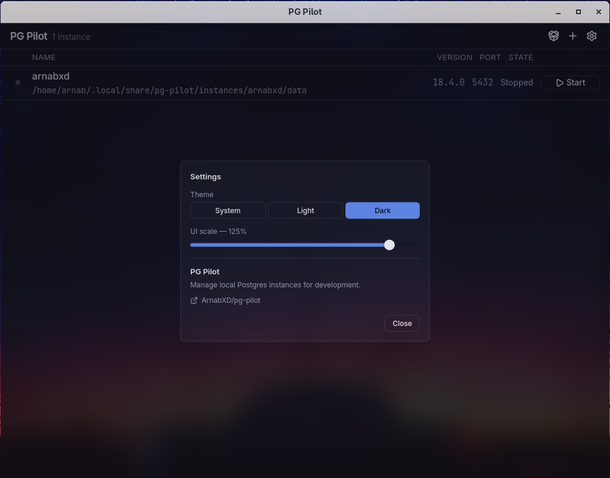

# pg-pilot

A lightweight Postgres.app alternative for Linux. Run one or more local,
named PostgreSQL instances without installing Postgres system-wide — binaries
are downloaded on demand and run entirely out of your home directory.



## Features

- Portable, per-user Postgres — no root, no system package, no native install
- Multiple Postgres major versions available side by side (17, 16, 15, 14)
- Multiple named instances, each with its own data dir and port, start/stop independently
- Log viewer, one-click connection string copy, and quick access to the data directory
- System tray icon — instances keep running when the window is closed
- Desktop launcher integration on Linux (see Installing below)







## How it works

Postgres binaries come from [zonky's `embedded-postgres-binaries`](https://mvnrepository.com/artifact/io.zonky.test.postgres)
(official EDB builds, no client tools bundled), downloaded and unpacked
in-process using pure-Go xz/tar — no system `xz`/`tar` dependency. Each
instance gets its own data directory and port under
`~/.local/share/pg-pilot/`; binaries for a given version are shared across
instances that use it.

## Development

Requires [Wails v2](https://wails.io) and [bun](https://bun.sh).

```sh
wails dev
```

On Fedora (webkit2gtk-4.1 instead of 4.0), pass the build tag:

```sh
wails dev -tags webkit2_41
```

## Building

```sh
wails build -tags webkit2_41   # drop the -tags flag if your distro ships webkit2gtk-4.0
```

Produces a binary at `build/bin/pg-pilot`.

## Installing

Grab the latest release from [Releases](https://github.com/ArnabXD/pg-pilot/releases).
Variants are published per architecture and per WebKitGTK ABI (the two aren't
ABI-compatible) — pick the one matching your machine:

| Variant | Distros |
| --- | --- |
| `linux-amd64-webkit2gtk41` | Fedora 40+, Ubuntu 24.04+, Debian trixie+, Arch, openSUSE Tumbleweed (x86_64) |
| `linux-amd64-webkit2gtk40` | Ubuntu 22.04, Debian 12 (x86_64) |
| `linux-arm64-webkit2gtk41` | Same distro set as amd64/gtk41, on arm64 (Raspberry Pi OS 64-bit, Asahi, etc.) |

Not sure which webkit ABI you have? `pkg-config --exists webkit2gtk-4.1 && echo 4.1 || echo 4.0`.
Check your arch with `uname -m` (`x86_64` → amd64, `aarch64` → arm64).

```sh
tar xzf pg-pilot-*-linux-*.tar.gz
cd pg-pilot-*-linux-*
./install.sh
```

This registers pg-pilot in your desktop's application launcher (user-local,
no root): the binary goes to `~/.local/bin`, the app icon to
`~/.local/share/icons/hicolor/`, and a `.desktop` entry to
`~/.local/share/applications/`. Make sure `~/.local/bin` is on your `PATH`.

Building from a checkout instead? `wails build -tags webkit2_41` then run
`./build/linux/install.sh` — it works from either location.

Releases are built automatically by [`.github/workflows/release.yml`](.github/workflows/release.yml)
on every `v*` tag push.
